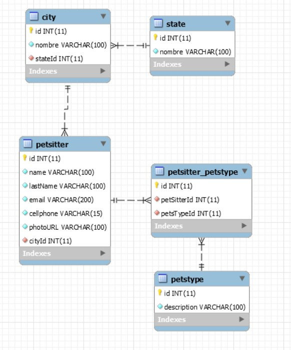

# Pet Sitters - Back-end Developer Test

**Modelo de la Base de Datos** :



<!-- Realizado con tecnologías/librerías como lo son:

-   [Vite](https://vitejs.dev/)
-   [React.js](https://es.reactjs.org/)
-   [Material-UI](https://mui.com/)
-   [React-Router-Dom](https://reactrouter.com/)
-   [mockapi](https://mockapi.io) -->

<!-- ## Instalación

Posicionarse en la carpeta raíz y ejecutar los siguientes comandos para ejecuta la aplicación de manera local:

```
cd pet-sitters
npm install
npm run dev
```
 -->
